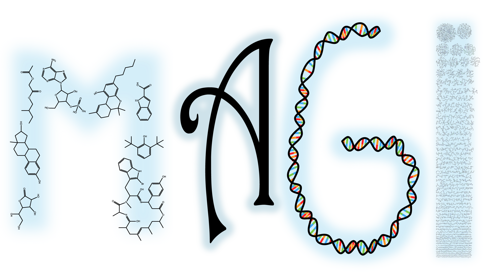

# Metabolites and Genes Integrated

Metagenomics and single-cell sequencing have enabled, for the first time, glimpses into the vast metabolic potential of Earth’s collective biological systems.  Yet, for the most part we can’t accurately predict nor identify the products of most biosynthetic pathways. Most of what we know of microbial biochemistry is based on characterization of a few model microorganisms, and these findings have been extended through sequence correlations to the rest of sequence space. Unfortunately, these extrapolations have questionable validity for the vast majority of environmental microbes and therefore requires fundamentally different approaches for directly linking novel sequences to their biochemical functions.

Our vision is to systematically explore dark-biochemistry, using state-of-the-art workflows that integrate large-scale DNA synthesis with metabolomics, high-performance computing, and chemoinformatics.  Bioinformatics mining of the over 500 billion unique genes catalogued by the DOE Joint Genome Institute can be used to prioritize high-novelty candidate biosynthesis clusters. Through synthetic biology approaches candidate clusters can be refactored and expressed in model organisms for characterization of the resulting biochemical activities and products with mass spectrometry. When integrated with novel chemoinformatic algorithms, this creates a closed-loop cycle of design, build, test, and learn for systematically mapping biochemical space.

For more documentation and a tutorial on how to analyze MAGI results, you can visit the
[MAGI website](https://magi.nersc.gov)
## Features

- Integrates a file of metabolites with a file of gene sequences
- A database of all publicly available reactions
- Compounds in those reactions
- API for accessing this information programmaticallly

## Docker Image (easiest, especially for Windows users)
We have created a Docker image that *should* make running MAGI locally a breeze! Please follow the steps in the [docs](docker/Docker_instructions.md).

## Local Installation (simple, not recommended for Windows users)
There are three steps you need to complete to install MAGI:
1. Clone the repository and set up local environment and paths
2. Install BLAST to the appropriate repository directory
3. Test MAGI to make sure it works correctly
4. (Optional) If interfacing with the magi website, you need to adjust some additional paths

These will take approximately 10 minutes to install.

### 1. Clone repository and set up environment
If you don't have Anaconda already, install [Anaconda](https://www.anaconda.com/distribution/) or [miniconda](https://docs.anaconda.com/docs_oss/conda/install/quick#miniconda-quick-install-requirements).

#### Linux & MacOS
The following will:
1. Set up your local settings files
2. Adjust a couple paths in the .py files.
3. Create a Conda environment for running MAGI

```bash
$ git clone https://github.com/biorack/magi.git
$ cd magi
$ python setup.py
$ conda env create -f magi_env.yml
$ source activate magi
```

#### Windows
The Windows installation is a little different.

```
$ git clone https://github.com/biorack/magi.git
$ cd magi
$ python setup_windows.py
$ conda env create -f magi_env.yml
$ activate magi
$ cd tests/full_workflow_test/
```

### 2. Install NCBI BLAST (Linux, MacOS, Windows)

Two [NCBI BLAST](https://www.ncbi.nlm.nih.gov/guide/howto/run-blast-local/) 
binaries are required to run MAGI.

You may download the BLAST binaries appropriate for your machine 
[here](https://www.ncbi.nlm.nih.gov/guide/howto/run-blast-local/), 
and simply copy the `blastp` and `makeblastdb` binaries into `workflow/blastbin`.

### 3. Test MAGI

To confirm everything was set up correctly, run the following test.
You will see some warnings; this is normal.
The test should take a few minutes.

#### Linux & MacOS

```bash
$ cd tests/full_workflow_test/
$ ./run_full_workflow_test.sh
```

#### Windows
```
$ python time python ../../workflow/magi_workflow.py --fasta ./s_coelicolor_genes_fasta_smallset.faa --compounds ./s_coelicolor_pactolus_data_smallset.csv --output ./test_output_files --cpu_count 4 --mute
```

### 4. Run MAGI locally

The easiest way to run MAGI locally is to copy the script run_magi.sh to a directory and to add your path to the MAGI directory, the path to your fasta and compounds file. Run the script from the command line. Note that some parts of this workflow are still under construction. For further details, you could use the --help function from the command line or read the README in the Workflow folder.

### 4. MAGI website interface (optional)

If you are interfacing with the magi_web repository, you need to manually change a few things in `magi_job/`; otherwise, ignore this section.

1. change local settings import path in magi_job/utils.py
2. set absolute path to workflow/magi_workflow.py in job_data() in magi_job/utils.py

## Local Installation (custom)

### Install NCBI BLAST

Two [NCBI BLAST](https://www.ncbi.nlm.nih.gov/guide/howto/run-blast-local/) 
binaries are required to run MAGI.

You may download the BLAST binaries appropriate for your machine 
[here](https://www.ncbi.nlm.nih.gov/guide/howto/run-blast-local/), 
and simply copy the `blastp` and `makeblastdb` binaries into `workflow/blastbin`.

### Python Dependencies

* Python 2.7
* pandas
* numpy
* rdkit
* molVS
* networkx
* pytables
* requests (only if you are using scripts in `magi_job/`)

### Local Settings

`local_settings/` should contain (at least) 3 files:

* `local_settings.py`
* `user_settings.py`
* `__init__.py`

`local_settings.py` should just have one line in it describing the name of the user_settings.py file:

```python
SETTINGS_FILE = 'user_settings'
```

`user_settings.py` should have the following paths and variables defined:

```python
repo_location = ''        # path to repo location
blastbin =      ''        # path to BLAST binary
refseq_path =   ''        # path to reaction reference sequence library
refseq_db =     ''        # path to BLAST database for reference sequence library
mrs_reaction_path = ''    # path to metabolite-reaction-refseq database
compounds_df =  ''        # path to compounds database
mst_path =  ''            # path to chemical similarity network graph
chemnet_pickle = ''       # path to chemical similarity network descriptions

# The next 2 lines are only required if you are interfacing with magi_web
magiwebsuperuser = ''     # admin username for magi_web
magiwebsuperuserpass = '' # admin password for magi_web
magiweburl = '' # URL to magi web (e.g. https://magi.nersc.gov)
```
When switching between machines or databases, you may have multiple `user_settings.py`
files that can be named whatever you want as long as the variable in `local_settings.py`
is defined correctly

## Acknowledgements
The development of MAGI was made possible by:
* [The U.S. Department of Energy Biological and Environmental Research Program](https://science.energy.gov/ber/)
* [Lawrence Berkeley National Laboratory](http://www.lbl.gov/)
* [The Joint Genome Institute](https://jgi.doe.gov/)
* [The National Energy Research Scientific Computing Center](http://www.nersc.gov/)
